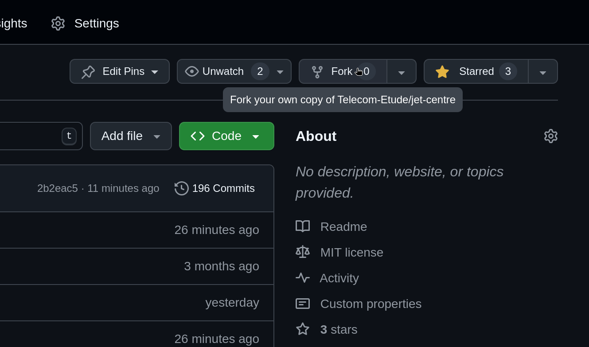

# Contributing to Jet Centre

Thank you for your interest in contributing to **Jet Centre**🚀! We're excited to have your help. Please review the guidelines below to ensure a smooth contribution process.

---

## Table of Contents

1. [Getting started](#getting-started)
2. [How to Contribute](#how-to-contribute)
    - [Reporting Issues](#reporting-issues)
    - [Contributing Code](#contributing-code)
3. [Style Guidelines](#style-guidelines)
4. [Commit messages](#commit-messages)

---

## Getting started

Please refer to the [Getting Started Guide](/docs/GETTING_STARTED.md) to know how to install and launch the project!

## How to Contribute

### Reporting Issues

If you find a bug or have a question:

1. Check the [issue tracker](https://github.com/telecom-etude/jet-centre/issues) to see if it’s already reported.
2. If it’s not listed, open a [new issue](https://github.com/telecom-etude/jet-centre/issues/new).
    - Provide a clear description of the issue.
    - Include steps to reproduce the problem.
    - Add screenshots or logs, if applicable.
    - We will answer shortly, please keep in touch!

### Contributing Code

1. [Fork](#fork) the project.
2. Create a clone of your forked git repo and add a remote pointing to this repo
   The remote ensures that your can easily pull more recent changes to your forked repo

```bash
git clone https://github.com/<your_username>/jet-centre.git
git remote upstream add https://github.com/Telecom-Etude/jet-centre.git
```

3. **Read the [Getting Started Guide](/docs/GETTING_STARTED.md)** to set up the project locally.
4. Make your changes, ensuring you follow the [Style Guidelines](#style-guidelines).
5. Once finished with all your code on your fork, make sure you are up-to-date with the `main` branch of `jet-centre`. You can use the following command to merge your changes with the original repo

```bash
git pull upstream main
```

6. Once finished, make a [Pull request](https://github.com/telecom-etude/jet-centre/pulls) with your fork.
    - Provide a clear description of the feature.
        - What the changes are.
        - The motivation behind them.
        - Any related [issues](<(https://github.com/telecom-etude/jet-centre/issues)>).
    - Add screenshots if applicable.
    - We will answer shortly, please keep in touch!

### Fork



### Style Guidelines

- Code Style: Follow Next.js best practices and use ESLint and Prettier.
- Formatting: Ensure code is formatted using the project's Prettier configuration.
    - If you use _vscode_, some extensions will be recommended when you install the project: please install them.
    - Otherwise, personally make sure your code is formatted and is correct relatively to the [.prettierrc] and [.eslintrc.json] files.

To format your code using the Prettier configuration, run one of the following command:

Makefile

```bash
make fmt
```

Legacy

```bash
npm run fmt
```

### Commit Messages

Follow the Conventional Commits format:

```txt
action(scope): what the commit does
```

> See [https://www.conventionalcommits.org](https://www.conventionalcommits.org) for more information.

_action_ **must** (cf. ci in [here](/.github/workflows/commits.yml)) be one of these:

- feat (add a new feature)
- fix (fix a bug, an issue)
- chore (update versions, add dependencies, CIs, etc.)
- docs (add documentation)
- style (change style)
- refactor (rewrite some code)
- perf (improve performance of some code)
- test (add tests)

_action_ is typically the answer to 'What will this commit do?'

_scope_ is typically the answer to 'Where does this commit make changes?' (some examples of scopes: sigin-page, authentication, github, docs, follow-page, create-page, etc.)

For instance, if you fix the redirection callback on the signin page, a good commit name is

```txt
fix(auth): redirection callback on the signin page
```
